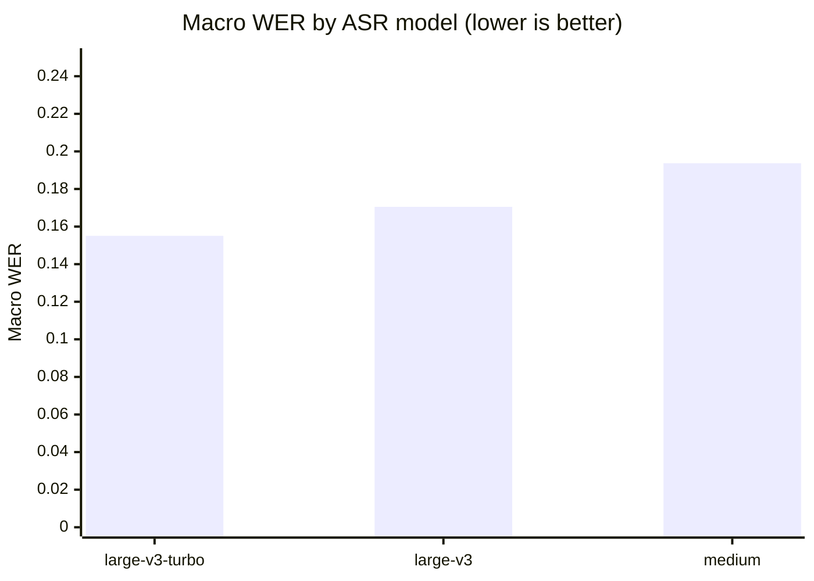
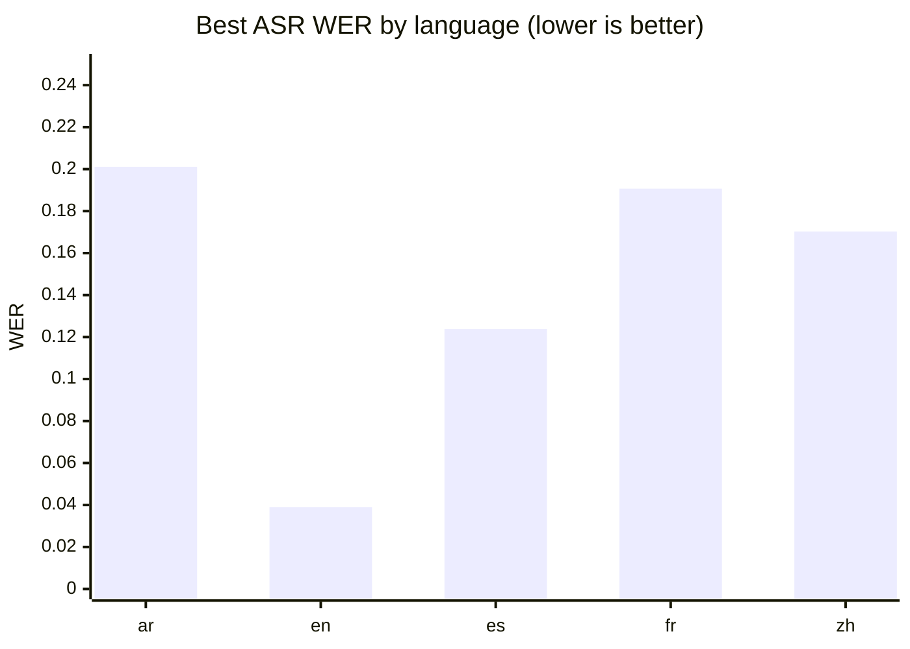
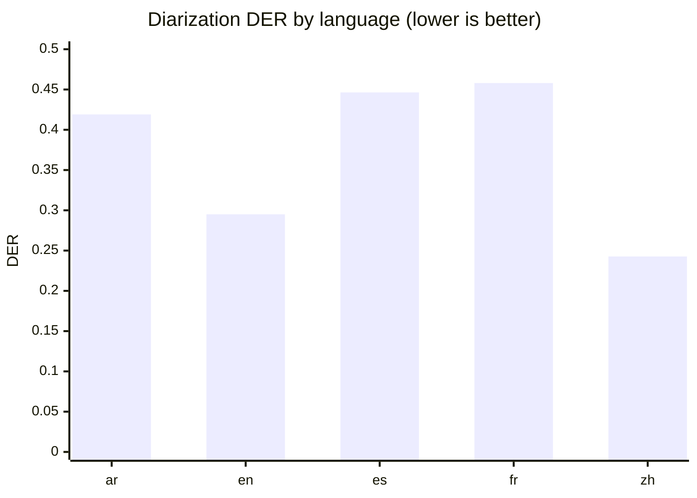
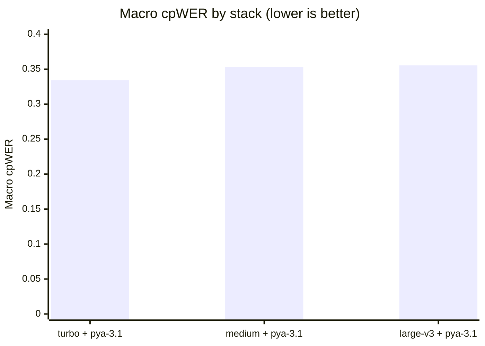
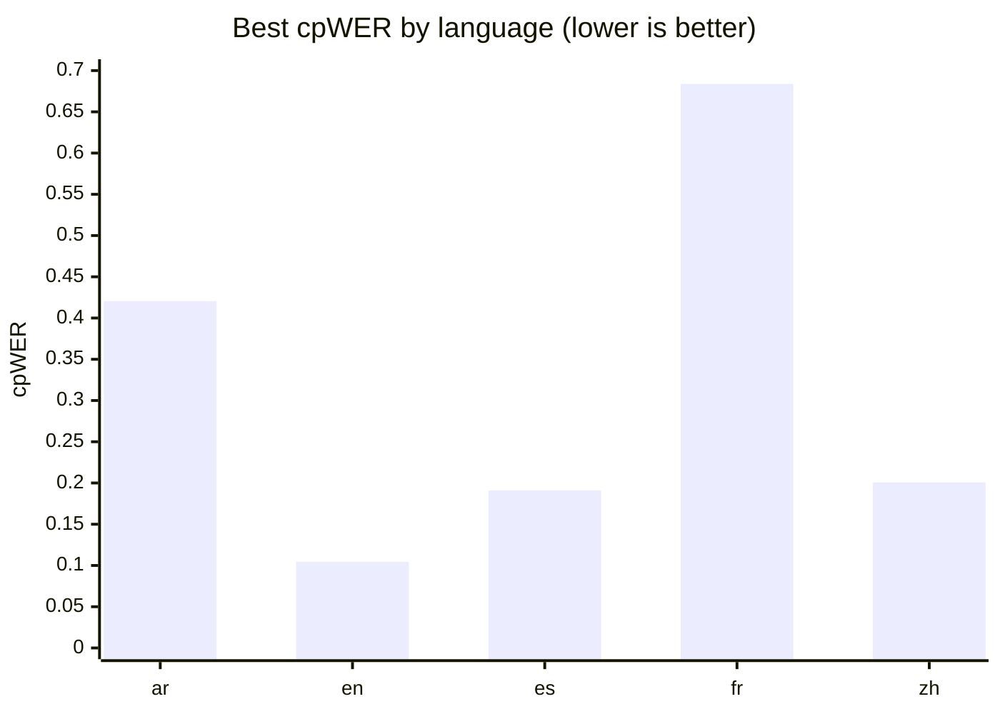

# GPU Speech-Stack Baseline: Multilingual ASR and Speaker-Attributed Transcription

**Run:** `2026-07-17_gpu_baseline_v1`  ·  **Track:** GPU  ·  **Profile:** baseline  ·  **Status:** completed

*Hardware:* NVIDIA GeForce RTX 4090 (26 GB) · Linux 6.8.0-134-generic · Python 3.12.3

---

## Abstract

We evaluate a self-hosted, open-weight speech stack for producing sentence-level,
speaker-attributed transcripts across five languages (Arabic, English, Spanish,
French, and Chinese). Three faster-whisper automatic-speech-recognition (ASR)
models are compared head-to-head, each fused with the `pyannote-3.1` diarization
pipeline, on 45 constructed multi-speaker conversations (~45 minutes per language)
built from Mozilla Common Voice speech with exact ground truth. Systems are scored
on transcription accuracy (WER/CER), diarization accuracy (DER), and end-to-end
speaker-attributed accuracy (cpWER), alongside runtime and memory cost. The
**`faster-whisper large-v3-turbo` + `pyannote-3.1`** stack is the recommended
configuration: it achieves the best macro cpWER (0.334) while running roughly
twice as fast as `large-v3` and using ~40% less GPU memory than it, at no accuracy
cost. Across every stack, French is the consistent weak point and English the
strongest, and diarization error — dominated by missed speech — is the largest
single contributor to end-to-end error.

---

## 1. Objective

The goal of this benchmark is to select a private, self-hosted GPU speech stack
that transcribes multi-speaker audio into sentence-level, speaker-labeled text.
Rather than treating ASR and diarization in isolation, we measure both the
individual components and their *fused* output, since the product target is a
speaker-attributed transcript. No single blended score is reported by design;
candidates are judged on their macro (cross-language) average together with their
worst-language and cross-language-consistency behavior.

## 2. Data

Speech is sourced from **Mozilla Common Voice Scripted Speech 26.0 (CC0)**,
obtained through the Mozilla Data Collective, using the full `validated` clip pool
for each locale (which — unlike the diversity-curated train/dev/test splits —
provides many clips per speaker). The evaluated locales are English, Spanish,
French, Arabic, and Chinese (zh-CN).

Evaluation recordings are **not** synthesized with text-to-speech. Instead, real
Common Voice clips from individual speakers are concatenated into constructed
multi-speaker conversations, which yields exact, word-level ground truth for both
the transcript and the speaker turns. Construction is fully deterministic (fixed
seed `20260717` plus stable hashing), and the exact clip selection is recorded to
`selection.json`. Under the **baseline** profile used here, each conversation runs
~5 minutes with 2–4 speakers, and each language contributes ~45 minutes of audio,
for **45 recordings total** across the five languages.

Because the underlying material is scripted read speech, these results should be
read as a **best-case floor**: real conversational, noisy, or overlapping audio in
production will produce higher error. The benchmark is therefore most useful as a
*relative ranking* of stacks, not as a prediction of field accuracy.

## 3. Models evaluated

Three ASR models were run, all from the faster-whisper family (CTranslate2
back-end), each auto-detecting language so that detection accuracy could be
measured:

- **`faster-whisper large-v3`** (MIT) — the full large model.
- **`faster-whisper large-v3-turbo`** (MIT) — a distilled-decoder variant, ~4×
  faster decoding than `large-v3` with a small expected quality loss.
- **`faster-whisper medium`** (MIT) — a smaller, cheaper model.

A single diarization pipeline was evaluated:

- **`pyannote-3.1`** (MIT weights; gated download requiring a Hugging Face token
  and one-time terms acceptance, then fully offline). Language-independent.

Each ASR model was fused with the diarizer to form three candidate stacks. Other
shortlisted systems (Voxtral, pyannote community-1 / pyannote.audio 4, NeMo
Sortformer) were disabled for this run and are left for follow-up in their
separate environments.

## 4. Methodology

The pipeline follows a **cache-then-fuse** design: each ASR model and the diarizer
run once per recording and their normalized outputs are cached; every ASR×diarizer
pair is then evaluated purely from cache, with metrics computed against references
only. One model is held in memory at a time, and peak RAM/VRAM are sampled during
inference.

Text metrics apply identical normalization to reference and hypothesis (Unicode
NFC, lowercasing, punctuation/symbol stripping, whitespace collapse, with Arabic
diacritic/alef normalization). Chinese is scored at the **character** level and
all other languages at the **word** level, so WER values are **not comparable
across languages** — comparisons are made within a language and across languages
only via the macro and consistency columns. Diarization DER uses a 0.5 s total
collar (±0.25 s) with overlap scored. End-to-end quality is measured with **cpWER**
(concatenated per-speaker token streams under an optimal speaker assignment, built
from word-level speaker labels), complemented by word- and sentence-level
attribution accuracy.

## 5. Results

### 5.1 Transcription (ASR only)

Averaged across the five languages, **`large-v3-turbo` was the most accurate ASR
model (macro WER 0.155)** and also the most *consistent*, with the smallest spread
across languages. Notably, the full `large-v3` was both slower and slightly less
accurate on this data than its turbo variant, and `medium` trailed both — most
visibly on its worst language (WER 0.349).

| ASR model         |  Macro WER ↓ | Worst-language WER | WER std (cross-lang) |    CER | RTF ↓ | Peak VRAM (MB) |
|:------------------|-------------:|-------------------:|---------------------:|-------:|------:|---------------:|
| `large-v3-turbo`  |   **0.1551** |             0.2250 |               0.0657 | 0.1052 | 0.012 |         3439.8 |
| `large-v3`        |       0.1705 |             0.2578 |               0.0789 | 0.1244 | 0.032 |         5980.9 |
| `medium`          |       0.1937 |             0.3488 |               0.1176 | 0.1402 | 0.016 |         3411.5 |

All three models achieved **100% language-detection accuracy** on every language,
so auto-detection is effectively free here. (One caveat: `medium` reported no
streaming latency numbers — time-to-first-text and finalization delay came back as
`nan` — which is a metrics-collection gap worth checking on the lab machine.)

**Figure 1 — Aggregate ASR accuracy (macro WER across languages, lower is better).**

**Figure 2 — Best achievable ASR WER by language (best model per language, lower is better).**

### 5.2 Diarization

The `pyannote-3.1` pipeline reached a **macro DER of 0.372**. Its error is almost
entirely **missed speech (0.303)** rather than false alarms (~0.000) or speaker
confusion (0.069) — i.e. the system *under-detects* speech rather than
hallucinating extra speakers or mixing them up. Speaker-count error (0.244)
reflects occasional under-counting of speakers. Diarization was the largest single
source of end-to-end error in this benchmark, and the missed-speech component is
the clearest target for future improvement (e.g. alternative diarizers or VAD
tuning).

**Figure 3 — `pyannote-3.1` diarization error by language (DER, lower is better).**

### 5.3 End-to-end speaker-attributed transcription (combined stacks)

Fusing each ASR model with `pyannote-3.1` and scoring the speaker-attributed
output gives the leaderboard below. The **`large-v3-turbo` stack leads on macro
cpWER (0.334)** while also being the fastest and the lightest of the accurate
configurations. The `medium` stack is a close second on cpWER and has a marginally
better worst-language number, but its component WER is meaningfully weaker. The
full `large-v3` stack is the least attractive here: it is the slowest, uses by far
the most VRAM (6.0 GB vs. 3.4 GB), and does not improve accuracy.

| Stack (ASR + `pyannote-3.1`) | Macro cpWER ↓ | Worst-lang cpWER | cpWER std | Word attrib. acc. | Sent. attrib. acc. | RTF ↓ | Peak VRAM (MB) |
|:-----------------------------|--------------:|-----------------:|----------:|------------------:|-------------------:|------:|---------------:|
| **`large-v3-turbo`**         |    **0.3341** |           0.6908 |    0.2279 |            0.8974 |             0.8595 | 0.019 |         3439.8 |
| `medium`                     |        0.3530 |           0.6838 |    0.2248 |            0.8965 |             0.8659 | 0.022 |         3411.5 |
| `large-v3`                   |        0.3554 |           0.6915 |    0.2227 |            0.8962 |             0.8590 | 0.038 |         5980.9 |

Word- and sentence-attribution accuracy are ~0.90 and ~0.86 across all three
stacks — the fusion step assigns speakers well, and the differences between stacks
are driven mainly by the ASR component, not by attribution.

**Figure 4 — Aggregate stack accuracy (macro cpWER across languages, lower is better).**

### 5.4 Per-language behavior

The macro numbers hide substantial per-language variation. **English is by far the
strongest language** (best-stack cpWER 0.104, ASR WER as low as 0.039), while
**French is the consistent weak point** — the worst language for every stack
(cpWER ~0.68) and also the hardest for diarization (DER 0.458). Arabic is the
hardest language for the diarizer specifically (DER 0.419), and Chinese, scored at
character level, sits mid-pack (best-stack cpWER 0.201).

The single best ASR model also differs by language — `medium` wins English and
Spanish, `large-v3` wins Arabic, and `large-v3-turbo` wins French and Chinese —
which is why the *most consistent* model (turbo) is preferred for a single
deployed stack over any per-language winner.

| Language | Best ASR (WER)             | Best diarizer (DER)   | Best stack (cpWER)                        |
|:---------|:---------------------------|:----------------------|:------------------------------------------|
| ar       | `large-v3` — 0.2011        | `pyannote-3.1` — 0.4191 | `medium` + `pyannote-3.1` — 0.4205       |
| en       | `medium` — 0.0390          | `pyannote-3.1` — 0.2950 | `medium` + `pyannote-3.1` — 0.1044       |
| es       | `medium` — 0.1238          | `pyannote-3.1` — 0.4464 | `medium` + `pyannote-3.1` — 0.1910       |
| fr       | `large-v3-turbo` — 0.1907  | `pyannote-3.1` — 0.4580 | `medium` + `pyannote-3.1` — 0.6838       |
| zh       | `large-v3-turbo` — 0.1703  | `pyannote-3.1` — 0.2427 | `large-v3-turbo` + `pyannote-3.1` — 0.2008 |

**Figure 5 — Best speaker-attributed accuracy by language (best stack per language, cpWER, lower is better).**

**Figure 6 — The three metrics side by side per language (best value each, lower is better).**
Reading across the columns shows where error enters: e.g. English is low on all three,
whereas French carries high diarization *and* cpWER, and Arabic is diarizer-limited.

| Language | ASR WER ↓ | Diarization DER ↓ | Combined cpWER ↓ |
|:---------|----------:|------------------:|-----------------:|
| ar       |    0.2011 |            0.4191 |           0.4205 |
| en       |    0.0390 |            0.2950 |           0.1044 |
| es       |    0.1238 |            0.4464 |           0.1910 |
| fr       |    0.1907 |            0.4580 |           0.6838 |
| zh       |    0.1703 |            0.2427 |           0.2008 |

## 6. Recommendation

**Recommended stack: `faster-whisper large-v3-turbo` + `pyannote-3.1`.**

It delivers the best macro cpWER (0.334) and the best macro ASR WER (0.155) with
the tightest cross-language consistency, while running ~2× faster than `large-v3`
and using ~40% less GPU memory (3.4 GB vs. 6.0 GB). The full `large-v3` offers no
accuracy advantage on this data to justify its higher cost, and while `medium` is
competitive on end-to-end cpWER, its weaker standalone transcription and missing
streaming metrics make it a less safe default. All candidates run far faster than
real time (RTF well below 1), so the choice is driven by accuracy and memory
rather than throughput.

## 7. Limitations and next steps

- **Best-case data.** Scripted read speech concatenated into conversations gives
  clean ground truth but is easier than spontaneous, noisy, or overlapping
  production audio; treat these numbers as a relative ranking and an accuracy
  floor.
- **Single diarizer.** Only `pyannote-3.1` was run. Since diarization (missed
  speech in particular) is the dominant error source, evaluating the disabled
  alternatives (pyannote community-1 / pyannote.audio 4, NeMo Sortformer) in their
  separate environments is the highest-value follow-up.
- **French regression.** French is the worst language across the board for both
  ASR and diarization; it deserves a targeted look to determine which component
  dominates the error.
- **Metrics gap.** `faster-whisper medium` returned `nan` for streaming
  latency metrics — worth fixing before relying on `medium`'s streaming profile.
- No failed or incomplete experiments were recorded in this run.

---

*CPU-track and GPU-track results are never merged, and no single blended score is
produced — by design (see docs/methodology.md). This report is derived entirely
from the cached results of run `2026-07-17_gpu_baseline_v1`.*
