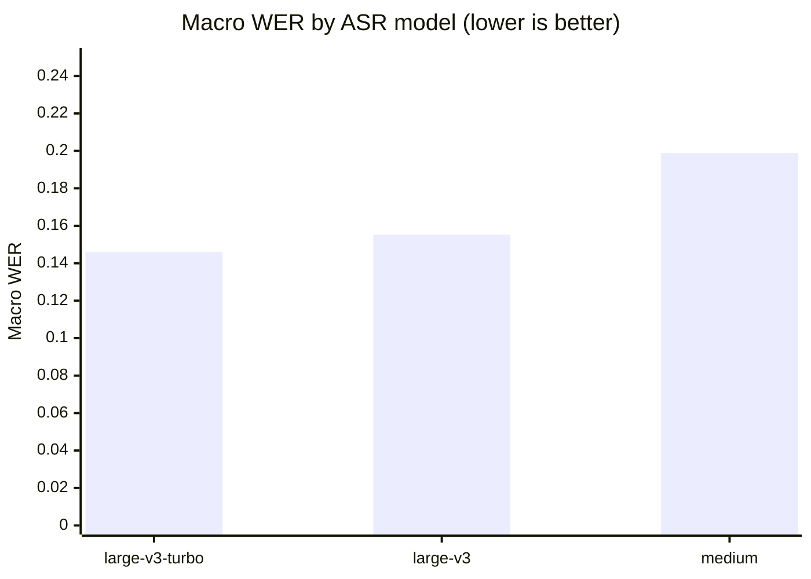
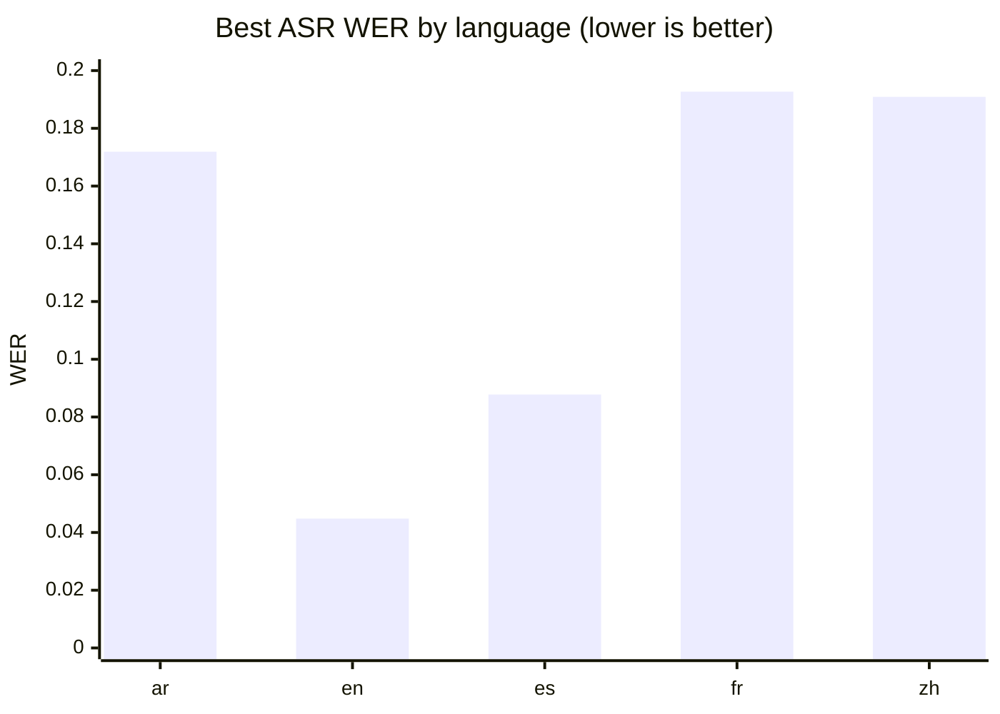
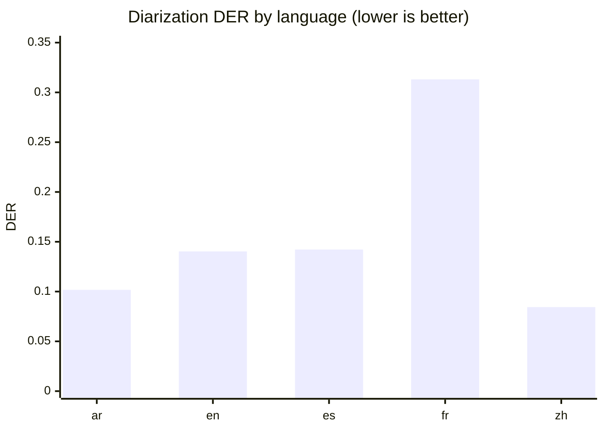
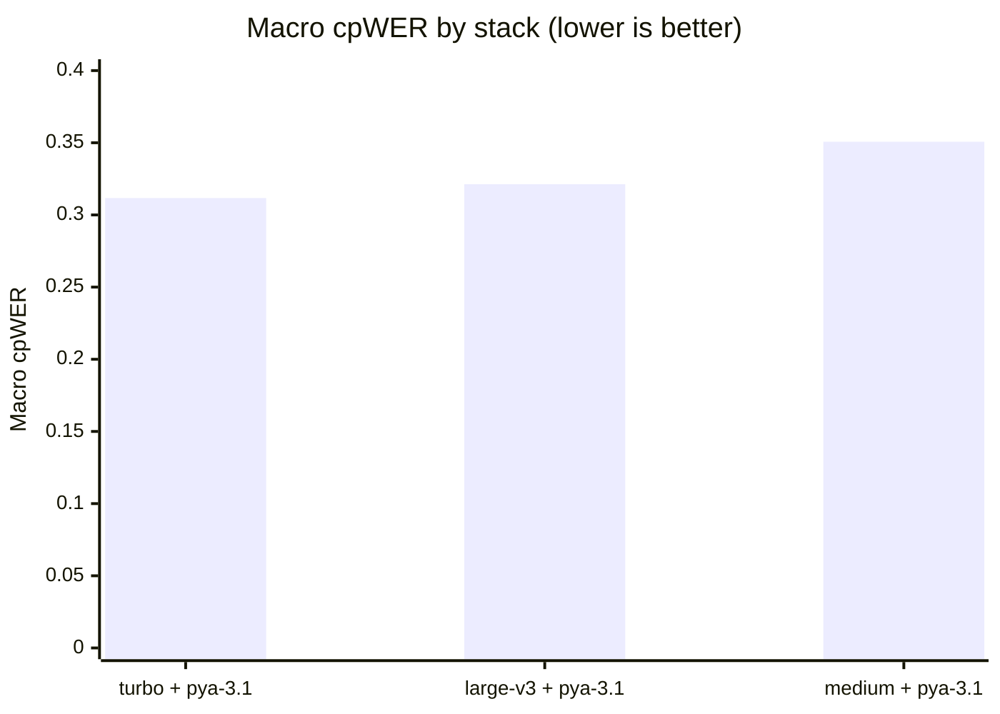
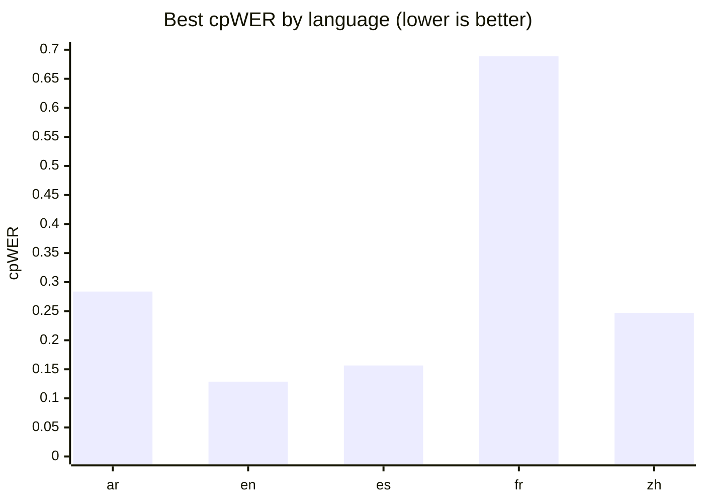

# GPU Speech-Stack Baseline: Multilingual ASR and Speaker-Attributed Transcription

**Run:** `2026-07-19_gpu_baseline_v1`  ·  **Track:** GPU  ·  **Profile:** baseline  ·  **Status:** completed

*Hardware:* NVIDIA GeForce RTX 4090 (26 GB) · Linux 6.8.0-134-generic · Python 3.12.3

> **Note (revision):** This run supersedes two earlier attempts whose diarization
> scores were inflated by a dataset-construction bug — reference speaker turns
> included the silence that Common Voice clips carry at their edges *and* in
> internal pauses, so the diarizer was charged with "missed speech" for correctly
> detecting silence. References now follow speech activity: each clip is split into
> voiced segments (`audio.voiced_segments`), and pauses are left unlabeled. The
> effect on DER is documented in §5.2.

---

## Abstract

We evaluate a self-hosted, open-weight speech stack for producing sentence-level,
speaker-attributed transcripts across five languages (Arabic, English, Spanish,
French, and Chinese). Three faster-whisper automatic-speech-recognition (ASR)
models are compared head-to-head, each fused with the `pyannote-3.1` diarization
pipeline, on 45 constructed multi-speaker conversations (~45 minutes per language)
built from Mozilla Common Voice speech with exact ground truth. Systems are scored
on transcription accuracy (WER/CER), diarization accuracy (DER), and end-to-end
speaker-attributed accuracy (cpWER), alongside runtime and memory cost. The
**`faster-whisper large-v3-turbo` + `pyannote-3.1`** stack is the recommended
configuration: it is the most accurate on both macro WER (0.146) and macro cpWER
(0.312) while running ~2× faster than `large-v3` and using ~40% less GPU memory.
After correcting the reference-silence artifact, diarization reaches a macro DER of
0.156, with speaker confusion now marginally exceeding missed speech — the expected
profile for clean, non-overlapping audio. French remains the weak language across
every metric; English and Chinese are the strongest.

---

## 1. Objective

The goal of this benchmark is to select a private, self-hosted GPU speech stack
that transcribes multi-speaker audio into sentence-level, speaker-labeled text.
Rather than treating ASR and diarization in isolation, we measure both the
individual components and their *fused* output, since the product target is a
speaker-attributed transcript. No single blended score is reported by design;
candidates are judged on their macro (cross-language) average together with their
worst-language and cross-language-consistency behavior.

## 2. Data

Speech is sourced from **Mozilla Common Voice Scripted Speech 26.0 (CC0)**,
obtained through the Mozilla Data Collective, using the full `validated` clip pool
for each locale (which — unlike the diversity-curated train/dev/test splits —
provides many clips per speaker). The evaluated locales are English, Spanish,
French, Arabic, and Chinese (zh-CN).

Evaluation recordings are **not** synthesized with text-to-speech. Instead, real
Common Voice clips from individual speakers are concatenated into constructed
multi-speaker conversations, which yields exact, word-level ground truth for both
the transcript and the speaker turns. Each source clip is segmented into **voiced
spans** before placement (see §5.2), so reference turns follow actual speech and
silent pauses become unlabeled gaps rather than labeled speech. Construction is
fully deterministic (fixed seed `20260717` plus stable hashing), and the exact clip
selection is recorded to `selection.json`. Under the **baseline** profile used here,
each conversation runs ~5 minutes with 2–4 speakers, and each language contributes
~45 minutes of audio, for **45 recordings total** across the five languages.

Because the underlying material is scripted read speech, these results should be
read as a **best-case floor**: real conversational, noisy, or overlapping audio in
production will produce higher error. The benchmark is therefore most useful as a
*relative ranking* of stacks, not as a prediction of field accuracy.

## 3. Models evaluated

Three ASR models were run, all from the faster-whisper family (CTranslate2
back-end), each auto-detecting language so that detection accuracy could be
measured:

- **`faster-whisper large-v3`** (MIT) — the full large model.
- **`faster-whisper large-v3-turbo`** (MIT) — a distilled-decoder variant, ~4×
  faster decoding than `large-v3` with a small expected quality loss.
- **`faster-whisper medium`** (MIT) — a smaller, cheaper model.

A single diarization pipeline was evaluated:

- **`pyannote-3.1`** (MIT weights; gated download requiring a Hugging Face token
  and one-time terms acceptance, then fully offline). Language-independent.

Each ASR model was fused with the diarizer to form three candidate stacks. Other
shortlisted systems (Voxtral, pyannote community-1 / pyannote.audio 4, NeMo
Sortformer) were disabled for this run and are left for follow-up in their
separate environments.

## 4. Methodology

The pipeline follows a **cache-then-fuse** design: each ASR model and the diarizer
run once per recording and their normalized outputs are cached; every ASR×diarizer
pair is then evaluated purely from cache, with metrics computed against references
only. One model is held in memory at a time, and peak RAM/VRAM are sampled during
inference.

Text metrics apply identical normalization to reference and hypothesis (Unicode
NFC, lowercasing, punctuation/symbol stripping, whitespace collapse, with Arabic
diacritic/alef normalization). Chinese is scored at the **character** level and all
other languages at the **word** level, so WER values are **not comparable across
languages** — comparisons are made within a language and across languages only via
the macro and consistency columns. Diarization DER uses a 0.5 s total collar
(±0.25 s) with overlap scored. End-to-end quality is measured with **cpWER**
(concatenated per-speaker token streams under an optimal speaker assignment, built
from word-level speaker labels), complemented by word- and sentence-level
attribution accuracy.

## 5. Results

### 5.1 Transcription (ASR only)

Averaged across the five languages, **`large-v3-turbo` is the most accurate ASR
model** (macro WER 0.146) *and* the most consistent (smallest cross-language spread
and the best worst-language WER, 0.196). It also beats the full `large-v3` while
running ~3× faster and using ~40% less GPU memory. `medium` trails both, most
visibly on its worst language (0.344).

| ASR model         |  Macro WER ↓ | Worst-language WER | WER std (cross-lang) |    CER | RTF ↓ | Peak VRAM (MB) |
|:------------------|-------------:|-------------------:|---------------------:|-------:|------:|---------------:|
| **`large-v3-turbo`** |  **0.1460** |         **0.1963** |           **0.0567** | 0.1041 | 0.014 |         3439.8 |
| `large-v3`        |       0.1552 |             0.2199 |               0.0673 | 0.1107 | 0.038 |         6050.3 |
| `medium`          |       0.1989 |             0.3443 |               0.0997 | 0.1490 | 0.019 |         3408.5 |

All three models achieved **100% language-detection accuracy** on every language,
so auto-detection is effectively free here. (One caveat: `medium` reported no
streaming latency numbers — time-to-first-text and finalization delay came back as
`nan` — which is a metrics-collection gap worth checking on the lab machine.)

**Figure 1 — Aggregate ASR accuracy (macro WER across languages, lower is better).**

**Figure 2 — Best achievable ASR WER by language (best model per language, lower is better).**

### 5.2 Diarization

**Reference-silence fix (two stages).** The diarizer's DER was initially dominated by
"missed speech" that was not the model's fault: reference turns spanned the whole
source clip, so the silence Common Voice clips carry — at the edges *and* in internal
pauses — was labeled as speech, and pyannote was penalized for correctly detecting
silence. Two builder changes corrected it: (1) trimming edge silence, then (2)
splitting each clip into voiced segments so internal pauses become unlabeled gaps.
A dedicated diagnostic (`scripts/diagnose_reference_silence.py`) confirmed the
label-forced "missed speech" floor fell from **11.9% → 3.6%** of reference speech.
The measured DER tracked it:

| Diarization metric (macro) | Padded refs | Edge-trim only | **Voiced-segment refs** |
|:---------------------------|------------:|---------------:|------------------------:|
| DER                        |      0.3722 |         0.2459 |              **0.1563** |
| Missed speech              |      0.3031 |         0.1514 |              **0.0660** |
| Speaker confusion          |      0.0690 |         0.0939 |                  0.0897 |
| False alarm                |      0.0002 |         0.0006 |                  0.0006 |
| Speaker-count error        |      0.2444 |        −0.0222 |                  0.1333 |

Macro DER fell **58%** from the original artifact-laden figure into pyannote-3.1's
normal range for clean audio. Crucially, **speaker confusion (0.090) now slightly
exceeds missed speech (0.066)** — the honest regime, where the remaining error is
genuine (telling voices apart) rather than a labeling artifact. False alarm stays
negligible. (Speaker-count error rose to +0.133: the extra turn boundaries from
segmenting occasionally lead pyannote to over-split a speaker — a minor,
watch-worthy side effect.)

**Figure 3 — `pyannote-3.1` diarization error by language (DER, lower is better).**

### 5.3 End-to-end speaker-attributed transcription (combined stacks)

Fusing each ASR model with `pyannote-3.1` and scoring the speaker-attributed output
gives the leaderboard below. **`large-v3-turbo` leads on macro cpWER (0.312)** at ~2×
the speed and half the VRAM of `large-v3`. `large-v3` edges it only on worst-language
cpWER (0.689 vs 0.706) and cross-language consistency (std 0.217 vs 0.227) — small
margins that do not justify its ~2× compute and memory. `medium` is a clear step
back. Word- and sentence-attribution accuracy (~0.90 / ~0.86) improved over the
previous run, reflecting the cleaner reference turns.

| Stack (ASR + `pyannote-3.1`) | Macro cpWER ↓ | Worst-lang cpWER | cpWER std | Word attrib. acc. | Sent. attrib. acc. | RTF ↓ | Peak VRAM (MB) |
|:-----------------------------|--------------:|-----------------:|----------:|------------------:|-------------------:|------:|---------------:|
| **`large-v3-turbo`**         |    **0.3117** |           0.7055 |    0.2267 |            0.9058 |             0.8580 | 0.020 |         3439.8 |
| `large-v3`                   |        0.3213 |       **0.6886** | **0.2168**|        **0.9086** |         **0.8670** | 0.045 |         6050.3 |
| `medium`                     |        0.3507 |           0.6959 |    0.2170 |            0.9037 |             0.8641 | 0.025 |         3408.5 |

As in prior runs, cpWER moved little from the diarization fix — it is a word-based
metric, and the corrected silence contained no words. The stacks are separated
mainly by their ASR component.

**Figure 4 — Aggregate stack accuracy (macro cpWER across languages, lower is better).**

### 5.4 Per-language behavior

The macro numbers hide substantial per-language variation. **English is the
strongest** (best-stack cpWER 0.129, WER 0.045), with **Chinese and Spanish** close
behind on the combined metric (0.247, 0.157) and lowest on DER (0.084, 0.142).
**French remains the clear weak point** — the worst language for every stack (cpWER
~0.69) and by far the hardest for diarization (DER 0.313 vs. ≤0.142 for the others).
Its DER barely moved with the silence fix, confirming French error is *genuine*
(confusion / missed real speech), not a labeling artifact. Arabic transcribes and
diarizes well (WER 0.172, DER 0.102) but carries a high combined cpWER (0.284),
indicating that speaker *attribution*, not raw transcription, limits Arabic.

The single best ASR model differs by language — `large-v3` wins Arabic, English, and
French, while `large-v3-turbo` wins Spanish and Chinese — but `turbo` is the most
consistent overall, which is why it is preferred for a single deployed stack over any
per-language winner.

| Language | Best ASR (WER)             | Best diarizer (DER)   | Best stack (cpWER)                          |
|:---------|:---------------------------|:----------------------|:--------------------------------------------|
| ar       | `large-v3` — 0.1719        | `pyannote-3.1` — 0.1017 | `large-v3-turbo` + `pyannote-3.1` — 0.2838 |
| en       | `large-v3` — 0.0448        | `pyannote-3.1` — 0.1403 | `large-v3` + `pyannote-3.1` — 0.1287       |
| es       | `large-v3-turbo` — 0.0878  | `pyannote-3.1` — 0.1422 | `large-v3-turbo` + `pyannote-3.1` — 0.1566 |
| fr       | `large-v3` — 0.1927        | `pyannote-3.1` — 0.3131 | `large-v3` + `pyannote-3.1` — 0.6886       |
| zh       | `large-v3-turbo` — 0.1909  | `pyannote-3.1` — 0.0844 | `large-v3-turbo` + `pyannote-3.1` — 0.2472 |

**Figure 5 — Best speaker-attributed accuracy by language (best stack per language, cpWER, lower is better).**

**Figure 6 — The three metrics side by side per language (best value each, lower is better).**
Reading across the columns shows where error enters: English and Chinese are low on
all three; French carries high diarization *and* cpWER; Arabic is low on WER and DER
but high on cpWER, i.e. attribution-limited.

| Language | ASR WER ↓ | Diarization DER ↓ | Combined cpWER ↓ |
|:---------|----------:|------------------:|-----------------:|
| ar       |    0.1719 |            0.1017 |           0.2838 |
| en       |    0.0448 |            0.1403 |           0.1287 |
| es       |    0.0878 |            0.1422 |           0.1566 |
| fr       |    0.1927 |            0.3131 |           0.6886 |
| zh       |    0.1909 |            0.0844 |           0.2472 |

## 6. Recommendation

**Recommended stack: `faster-whisper large-v3-turbo` + `pyannote-3.1`.**

On the corrected data `turbo` is the outright winner: best macro WER (0.146) and best
macro cpWER (0.312), the tightest ASR consistency, ~2–3× the throughput of `large-v3`
(RTF 0.020 vs 0.045), and ~40% less GPU memory (3.4 GB vs 6.0 GB). `large-v3` wins
only marginal tie-breakers (worst-language cpWER and attribution accuracy) that do
not offset its cost, and `medium` is a clear step back on both WER and cpWER. All
candidates run far faster than real time, so the choice is driven by accuracy and
memory, both of which favor `turbo`.

## 7. Limitations and next steps

- **Best-case data.** Scripted read speech concatenated into conversations gives
  clean ground truth but is easier than spontaneous, noisy, or overlapping
  production audio; treat these numbers as a relative ranking and an accuracy floor.
- **Single diarizer.** Only `pyannote-3.1` was run. With the reference artifact
  removed, the remaining diarization error is genuine speaker confusion — so
  evaluating the disabled alternatives (pyannote community-1 / pyannote.audio 4, NeMo
  Sortformer) in their separate environments is now the highest-value follow-up.
- **French.** French is the persistent weak point across ASR, diarization, and cpWER,
  and its DER is genuine rather than artifactual — worth a targeted error analysis.
- **Speaker-count over-split.** Segmenting turns nudged speaker-count error positive
  (+0.133); worth checking whether it inflates confusion on any language.
- **Metrics gap.** `faster-whisper medium` returned `nan` for streaming latency
  metrics — worth fixing before relying on `medium`'s streaming profile.
- No failed or incomplete experiments were recorded in this run.

---

*CPU-track and GPU-track results are never merged, and no single blended score is
produced — by design (see docs/methodology.md). This report is derived entirely from
the cached results of run `2026-07-19_gpu_baseline_v1`.*
