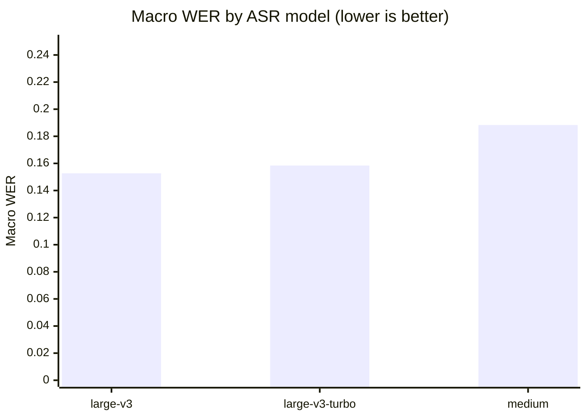
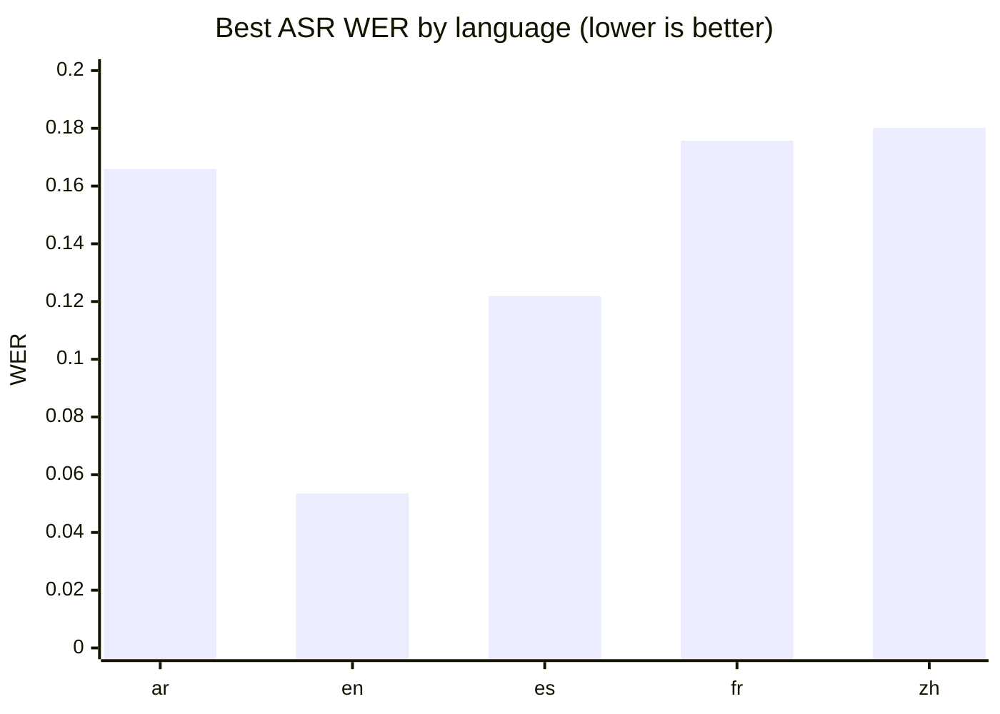
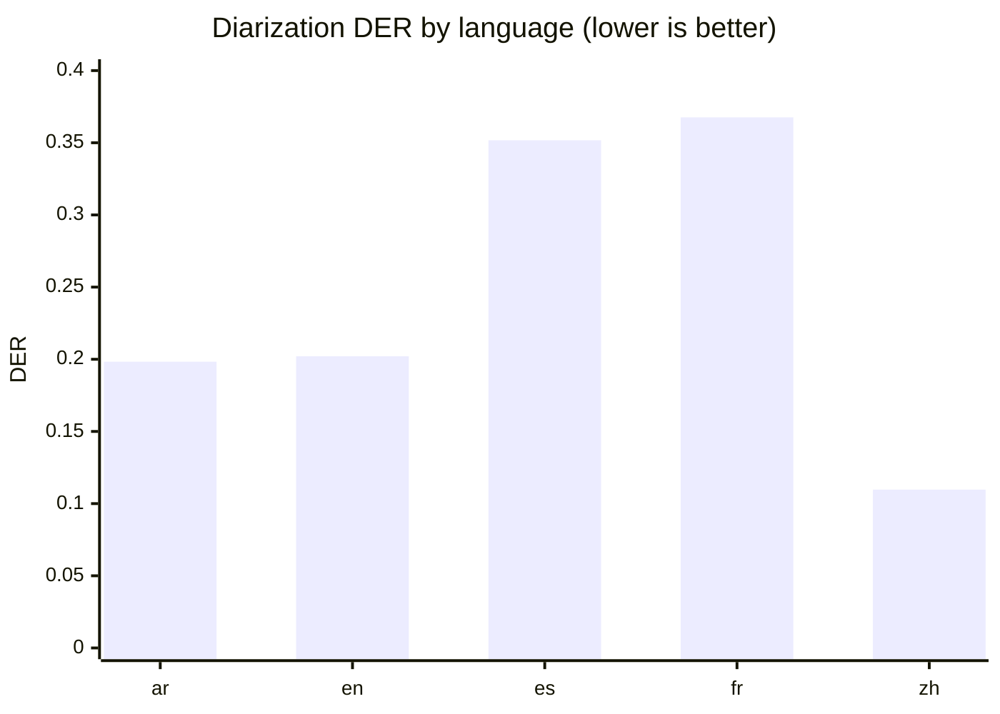
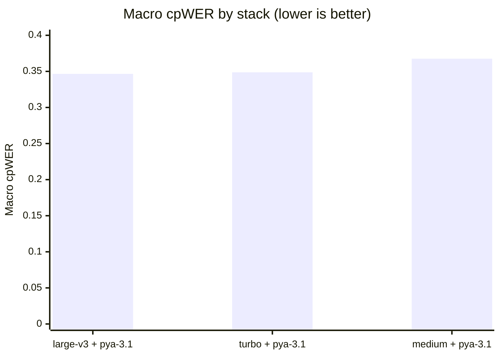
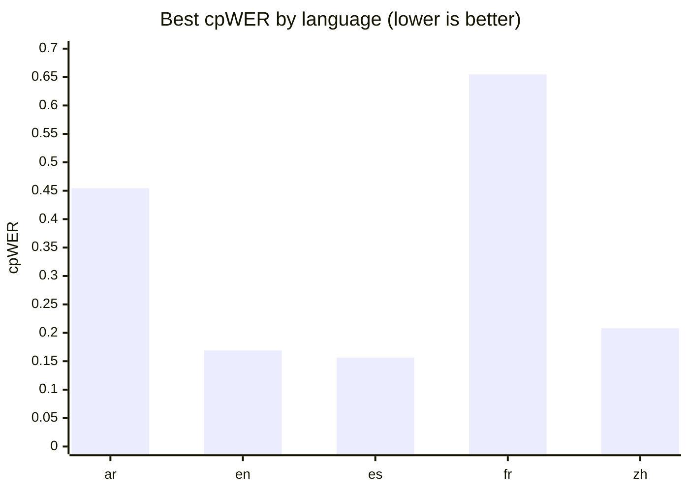

# GPU Speech-Stack Baseline: Multilingual ASR and Speaker-Attributed Transcription

**Run:** `2026-07-19_gpu_baseline_v1`  ·  **Track:** GPU  ·  **Profile:** baseline  ·  **Status:** completed

*Hardware:* NVIDIA GeForce RTX 4090 (26 GB) · Linux 6.8.0-134-generic · Python 3.12.3

> **Note (revision):** This run supersedes `2026-07-17_gpu_baseline_v1`. The earlier
> run's diarization scores were inflated by a dataset-construction bug: reference
> speaker turns were set to the full source-clip span, including the silence that
> Common Voice clips carry at their edges, so the diarizer was charged with "missed
> speech" for correctly detecting silence. The clips are now silence-trimmed
> (`audio.trim_silence`) before reference turns are assigned. See §5.2.

---

## Abstract

We evaluate a self-hosted, open-weight speech stack for producing sentence-level,
speaker-attributed transcripts across five languages (Arabic, English, Spanish,
French, and Chinese). Three faster-whisper automatic-speech-recognition (ASR)
models are compared head-to-head, each fused with the `pyannote-3.1` diarization
pipeline, on 45 constructed multi-speaker conversations (~45 minutes per language)
built from Mozilla Common Voice speech with exact ground truth. Systems are scored
on transcription accuracy (WER/CER), diarization accuracy (DER), and end-to-end
speaker-attributed accuracy (cpWER), alongside runtime and memory cost. The
**`faster-whisper large-v3-turbo` + `pyannote-3.1`** stack is the recommended
configuration: it is within noise of the most accurate stack on macro cpWER (0.349
vs. 0.347) and best on worst-language and cross-language consistency, while running
~2× faster than `large-v3` and using ~40% less GPU memory. Across every stack,
French remains the weak point and English the strongest, and diarization — now
corrected for the reference-silence artifact — contributes a macro DER of 0.246,
with missed speech still its largest single component.

---

## 1. Objective

The goal of this benchmark is to select a private, self-hosted GPU speech stack
that transcribes multi-speaker audio into sentence-level, speaker-labeled text.
Rather than treating ASR and diarization in isolation, we measure both the
individual components and their *fused* output, since the product target is a
speaker-attributed transcript. No single blended score is reported by design;
candidates are judged on their macro (cross-language) average together with their
worst-language and cross-language-consistency behavior.

## 2. Data

Speech is sourced from **Mozilla Common Voice Scripted Speech 26.0 (CC0)**,
obtained through the Mozilla Data Collective, using the full `validated` clip pool
for each locale (which — unlike the diversity-curated train/dev/test splits —
provides many clips per speaker). The evaluated locales are English, Spanish,
French, Arabic, and Chinese (zh-CN).

Evaluation recordings are **not** synthesized with text-to-speech. Instead, real
Common Voice clips from individual speakers are concatenated into constructed
multi-speaker conversations, which yields exact, word-level ground truth for both
the transcript and the speaker turns. Each source clip is **silence-trimmed** before
placement (see §5.2), so a reference turn spans only the actual speech. Construction
is fully deterministic (fixed seed `20260717` plus stable hashing), and the exact
clip selection is recorded to `selection.json`. Under the **baseline** profile used
here, each conversation runs ~5 minutes with 2–4 speakers, and each language
contributes ~45 minutes of audio, for **45 recordings total** across the five
languages.

Because the underlying material is scripted read speech, these results should be
read as a **best-case floor**: real conversational, noisy, or overlapping audio in
production will produce higher error. The benchmark is therefore most useful as a
*relative ranking* of stacks, not as a prediction of field accuracy.

## 3. Models evaluated

Three ASR models were run, all from the faster-whisper family (CTranslate2
back-end), each auto-detecting language so that detection accuracy could be
measured:

- **`faster-whisper large-v3`** (MIT) — the full large model.
- **`faster-whisper large-v3-turbo`** (MIT) — a distilled-decoder variant, ~4×
  faster decoding than `large-v3` with a small expected quality loss.
- **`faster-whisper medium`** (MIT) — a smaller, cheaper model.

A single diarization pipeline was evaluated:

- **`pyannote-3.1`** (MIT weights; gated download requiring a Hugging Face token
  and one-time terms acceptance, then fully offline). Language-independent.

Each ASR model was fused with the diarizer to form three candidate stacks. Other
shortlisted systems (Voxtral, pyannote community-1 / pyannote.audio 4, NeMo
Sortformer) were disabled for this run and are left for follow-up in their
separate environments.

## 4. Methodology

The pipeline follows a **cache-then-fuse** design: each ASR model and the diarizer
run once per recording and their normalized outputs are cached; every ASR×diarizer
pair is then evaluated purely from cache, with metrics computed against references
only. One model is held in memory at a time, and peak RAM/VRAM are sampled during
inference.

Text metrics apply identical normalization to reference and hypothesis (Unicode
NFC, lowercasing, punctuation/symbol stripping, whitespace collapse, with Arabic
diacritic/alef normalization). Chinese is scored at the **character** level and
all other languages at the **word** level, so WER values are **not comparable
across languages** — comparisons are made within a language and across languages
only via the macro and consistency columns. Diarization DER uses a 0.5 s total
collar (±0.25 s) with overlap scored. End-to-end quality is measured with **cpWER**
(concatenated per-speaker token streams under an optimal speaker assignment, built
from word-level speaker labels), complemented by word- and sentence-level
attribution accuracy.

## 5. Results

### 5.1 Transcription (ASR only)

Averaged across the five languages, **`large-v3` and `large-v3-turbo` are
statistically tied on accuracy** (macro WER 0.153 vs. 0.158), with `turbo` the more
*consistent* of the two (smallest cross-language spread, and the best worst-language
WER at 0.189). `medium` trails both, most visibly on its worst language (0.342).

| ASR model         |  Macro WER ↓ | Worst-language WER | WER std (cross-lang) |    CER | RTF ↓ | Peak VRAM (MB) |
|:------------------|-------------:|-------------------:|---------------------:|-------:|------:|---------------:|
| `large-v3`        |   **0.1527** |             0.2225 |               0.0663 | 0.1095 | 0.040 |         6022.7 |
| `large-v3-turbo`  |       0.1584 |         **0.1891** |           **0.0484** | 0.1099 | 0.015 |         3438.3 |
| `medium`          |       0.1883 |             0.3417 |               0.1068 | 0.1383 | 0.019 |         3424.1 |

All three models achieved **100% language-detection accuracy** on every language,
so auto-detection is effectively free here. (One caveat: `medium` reported no
streaming latency numbers — time-to-first-text and finalization delay came back as
`nan` — which is a metrics-collection gap worth checking on the lab machine.)

**Figure 1 — Aggregate ASR accuracy (macro WER across languages, lower is better).**

**Figure 2 — Best achievable ASR WER by language (best model per language, lower is better).**

### 5.2 Diarization

**Reference-silence fix.** In the previous run, reference speaker turns spanned the
entire source clip, including the leading/trailing silence Common Voice clips carry.
The diarizer's VAD correctly reported no speech in that silence and was charged with
**missed speech** — an artifact of the *reference*, not the model. Clips are now
trimmed with `audio.trim_silence` (frame-RMS gate at 40 dB below peak, with a 30 ms
pad) before their reference turns are set, so turns hug actual speech. The effect is
large and exactly where predicted:

| Diarization metric (macro) | Old (`2026-07-17`) | New (`2026-07-19`) |
|:---------------------------|-------------------:|-------------------:|
| DER                        |             0.3722 |         **0.2459** |
| Missed speech              |             0.3031 |         **0.1514** |
| False alarm                |             0.0002 |             0.0006 |
| Speaker confusion          |             0.0690 |             0.0939 |
| Speaker-count error        |             0.2444 |        **−0.0222** |

Macro DER falls **34%** into pyannote-3.1's normal operating range, driven almost
entirely by the halving of missed speech, and speaker-count error collapses to ~0
(the diarizer now neither over- nor under-counts on average). Missed speech (0.151)
is still the largest single DER component and the clearest remaining target;
false alarm stays negligible, and speaker confusion (0.094) is low.

**Figure 3 — `pyannote-3.1` diarization error by language (DER, lower is better).**

### 5.3 End-to-end speaker-attributed transcription (combined stacks)

Fusing each ASR model with `pyannote-3.1` and scoring the speaker-attributed output
gives the leaderboard below. The three stacks are **very close on macro cpWER**
(0.347–0.368): `large-v3` edges `turbo` by 0.002 — within run-to-run noise — while
`turbo` wins **worst-language cpWER (0.655)** and **consistency (std 0.201)**, and
does so at half the VRAM (3.4 vs. 6.0 GB) and ~2× the speed. `medium` is a step back
on cpWER. Note that cpWER barely changed from the previous run: it is a **word-based**
metric, so the reference-silence bug (silent time containing no words) never affected
it — only the time-based DER moved.

| Stack (ASR + `pyannote-3.1`) | Macro cpWER ↓ | Worst-lang cpWER | cpWER std | Word attrib. acc. | Sent. attrib. acc. | RTF ↓ | Peak VRAM (MB) |
|:-----------------------------|--------------:|-----------------:|----------:|------------------:|-------------------:|------:|---------------:|
| `large-v3`                   |    **0.3465** |           0.6624 |    0.2119 |            0.8895 |             0.8529 | 0.046 |         6022.7 |
| **`large-v3-turbo`**         |        0.3487 |       **0.6546** | **0.2013**|        **0.8902** |             0.8517 | 0.021 |         3438.3 |
| `medium`                     |        0.3676 |           0.6605 |    0.2108 |            0.8883 |         **0.8599** | 0.026 |         3424.2 |

Word- and sentence-attribution accuracy sit at ~0.89 and ~0.85 across all three
stacks — the fusion step assigns speakers well, and the differences between stacks
are driven by the ASR component, not by attribution.

**Figure 4 — Aggregate stack accuracy (macro cpWER across languages, lower is better).**

### 5.4 Per-language behavior

The macro numbers hide substantial per-language variation. **English and Chinese are
the strongest** (best-stack cpWER 0.169 and 0.208; Chinese has the lowest DER at
0.110), while **French remains the weak point** — the worst language for every stack
(cpWER ~0.65) and, with Spanish, the hardest for diarization (DER 0.368 / 0.352).
Arabic transcribes and diarizes reasonably (WER 0.166, DER 0.198) but has a high
combined cpWER (0.454), indicating that speaker *attribution*, not raw transcription,
is what limits Arabic.

The single best ASR model differs by language — `large-v3` wins Arabic and English,
`medium` wins Spanish, and `large-v3-turbo` wins French and Chinese — which is why
the *most consistent* model (turbo) is preferred for a single deployed stack over any
per-language winner.

| Language | Best ASR (WER)             | Best diarizer (DER)   | Best stack (cpWER)                          |
|:---------|:---------------------------|:----------------------|:--------------------------------------------|
| ar       | `large-v3` — 0.1659        | `pyannote-3.1` — 0.1983 | `large-v3-turbo` + `pyannote-3.1` — 0.4543 |
| en       | `large-v3` — 0.0535        | `pyannote-3.1` — 0.2021 | `large-v3` + `pyannote-3.1` — 0.1689       |
| es       | `medium` — 0.1219          | `pyannote-3.1` — 0.3517 | `medium` + `pyannote-3.1` — 0.1565         |
| fr       | `large-v3-turbo` — 0.1757  | `pyannote-3.1` — 0.3676 | `large-v3-turbo` + `pyannote-3.1` — 0.6546 |
| zh       | `large-v3-turbo` — 0.1801  | `pyannote-3.1` — 0.1097 | `large-v3-turbo` + `pyannote-3.1` — 0.2081 |

**Figure 5 — Best speaker-attributed accuracy by language (best stack per language, cpWER, lower is better).**

**Figure 6 — The three metrics side by side per language (best value each, lower is better).**
Reading across the columns shows where error enters: English is low on all three;
French carries high diarization *and* cpWER; Arabic is low on WER and DER but high on
cpWER, i.e. attribution-limited.

| Language | ASR WER ↓ | Diarization DER ↓ | Combined cpWER ↓ |
|:---------|----------:|------------------:|-----------------:|
| ar       |    0.1659 |            0.1983 |           0.4543 |
| en       |    0.0535 |            0.2021 |           0.1689 |
| es       |    0.1219 |            0.3517 |           0.1565 |
| fr       |    0.1757 |            0.3676 |           0.6546 |
| zh       |    0.1801 |            0.1097 |           0.2081 |

## 6. Recommendation

**Recommended stack: `faster-whisper large-v3-turbo` + `pyannote-3.1`.**

On the corrected data the three stacks are effectively tied on macro cpWER (`turbo`
0.349 vs. `large-v3` 0.347 — a 0.6% relative gap, within noise), but `turbo` wins the
tie-breakers that matter for deployment: the best worst-language cpWER (0.655), the
tightest cross-language consistency (std 0.201), ~2× the throughput (RTF 0.021 vs.
0.046), and ~40% less GPU memory (3.4 GB vs. 6.0 GB). `large-v3` buys no meaningful
accuracy for its higher cost, and `medium`, while cheap, is a clear step back on both
WER and cpWER. All candidates run far faster than real time, so the choice is driven
by accuracy-per-cost and consistency rather than throughput.

## 7. Limitations and next steps

- **Best-case data.** Scripted read speech concatenated into conversations gives
  clean ground truth but is easier than spontaneous, noisy, or overlapping
  production audio; treat these numbers as a relative ranking and an accuracy floor.
- **Single diarizer.** Only `pyannote-3.1` was run. Since missed speech (0.151) is
  still the largest DER component, evaluating the disabled alternatives (pyannote
  community-1 / pyannote.audio 4, NeMo Sortformer) in their separate environments is
  the highest-value follow-up.
- **French and Arabic.** French is worst across the board for both ASR and
  diarization; Arabic is attribution-limited (low WER/DER but high cpWER). Both
  deserve a targeted look at whether ASR or the fusion/attribution step dominates.
- **Metrics gap.** `faster-whisper medium` returned `nan` for streaming latency
  metrics — worth fixing before relying on `medium`'s streaming profile.
- No failed or incomplete experiments were recorded in this run.

---

*CPU-track and GPU-track results are never merged, and no single blended score is
produced — by design (see docs/methodology.md). This report is derived entirely
from the cached results of run `2026-07-19_gpu_baseline_v1`.*
